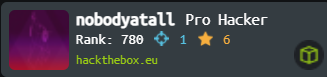

  

## Welcome to the NobodyAtall Git Repo

### About Me
I'm a Computer Science Student & a CTF player that's passion in CyberSec & Penetration Testing. Been doing my pentesting & cyberSec research myself since 2019 July. In my git repo I'll be adding my writeup, exploit script, or any interesting stuff that I found throughout my pentesting. Here are my public profile links:-

YouTube: https://www.youtube.com/c/nobodyatall  
LinkedIn: https://www.linkedin.com/in/bryan-leong-a66160206/  
Medium: https://bryanleong98.medium.com/

### Statistic

### Donation
If my works help you reduce time to develop, in pentesting or in research, you can give me a cup of coffee :) 

Bitcoin : 1HgMQAftKUnMHvGsNTkpuLHZYehHfqDT61  
Ethereum: 0x13AE19b1550B9d66372072c00a1a9762f5dB11B5

### Contact
If you guys want to contact me, do drop me an email.  
Email: nobodyatall648@protonmail.com
